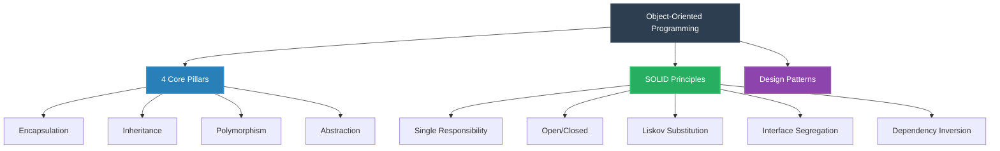

# 🏛️ Object-Oriented Programming (OOPs) Repository

<p align="center">
  
  
  
</p>

---

## 🗺️ Core Architecture & Roadmap


---

| Pillar | Concept Visualization | Visual Code Blueprint |
| :--- | :--- | :--- |
| **Encapsulation** | 🔒 Data Hiding & Bundling | `[ Data + Methods ] ➔ 💊 Capsule (Class)` |
| **Inheritance** | 🌿 Parent-Child Hierarchy | `Base Class ➔ ⏬ Extended ➔ Derived Class` |
| **Polymorphism** | 🎭 One Interface, Many Forms | `Execute() ➔ ⚡ Method Overriding / Overloading` |
| **Abstraction** | 🔍 Hiding Details, Showing Essentials | `User Interface ➔ 🛠️ [ Hidden Implementation ]` |

---

### 📐 SOLID Principles Implementation Status
- [ ] S - Single Responsibility Principle [ 🟩 Done ]

- [ ] O - Open/Closed Principle [ 🟩 Done ]

- [ ] L - Liskov Substitution Principle [ 🟨 In Progress ]

- [ ] I - Interface Segregation Principle [ 🟥 Planned ]

- [ ] D - Dependency Inversion Principle [ 🟥 Planned ]

---
### 🤝 Contribution Workflow
```shell
gitGraph
    commit id: "Initial Commit"
    branch feature-oop
    checkout feature-oop
    commit id: "Add OOP Concept"
    commit id: "Fix Structural Code"
    checkout main
    merge feature-oop
    commit id: "Release v1.0"
```
